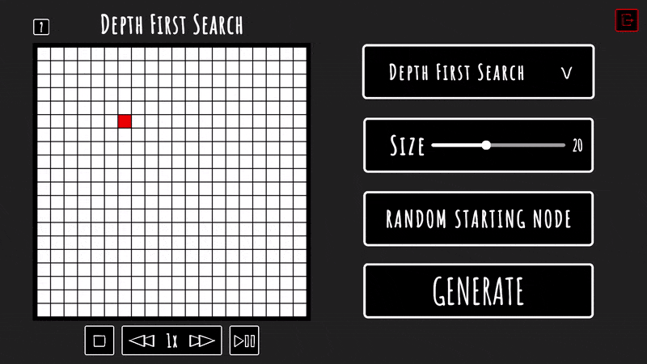
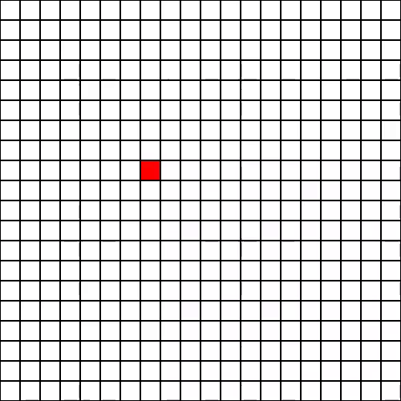
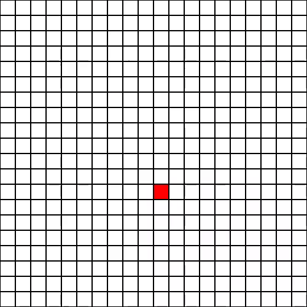
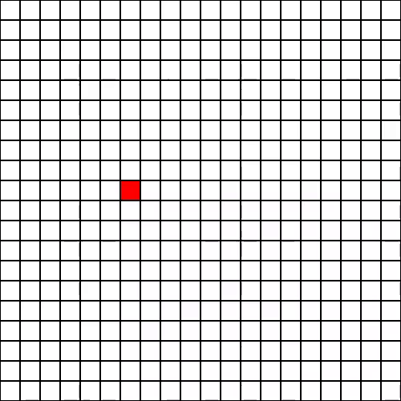

# Maze Visualizer  

Mazes have always been fascinating, and this project is my way of exploring them through procedural generation. It brings different maze algorithms to life, letting you see how they work in real time.  

  

---

## Features  

### 🧩 Maze Generation Algorithms (for now :>)
- **Depth First Search**  
- **Simplified Prim’s Algorithm**  
- **Hunt & Kill**  

### ⚙️ Customization Options  
- Adjustable maze size  
- Randomized starting point selection  
- Control over generation speed  
- Pause, resume, and reset functionality  

### 💡 Algorithm Insights  
- A small info button displays the algorithm’s logic in pseudocode for those interested in the underlying process.  

---

## 📌 Algorithm Previews  

### Depth First Search  
Creates long, winding passages with a strong bias towards deep paths.  


### Simplified Prim's Algorithm  
Generates more uniform, open mazes by expanding walls randomly.  
  

### Hunt and Kill  
An unpredictable mix of random walks and systematic backtracking.  
  

---

## 📥 Try It Out  

You can experience the maze visualizer in two ways:  

1. **Download the project and run it in Unity**  
   - Clone the repository:  
     ```bash
     git clone https://github.com/WojtusMientus/maze-visualizer.git
     cd maze-visualizer
     ```
   - Open the project in Unity (version XYZ).  
   - Run the scene to start visualizing mazes!  

2. **Download the standalone executable from itch.io**  
   - [▶ Get the latest version on itch.io](https://wojciech-maciejewski.itch.io/)  

---

## 🔧 Planned Features  
✔️ More generation algorithms  
✔️ Manual start-point selection  
✔️ Maze-solving visualization  
✔️ Sound effects  

---
